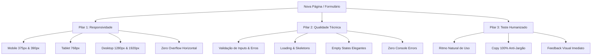

# Frontend Page Testing — SinalizeGO

Este guia estabelece o padrão de excelência e qualidade para a criação, refatoração e validação de páginas, formulários e componentes interativos no frontend do **SinalizeGO** (React 19, TypeScript, Tailwind CSS, Vite) utilizando **Playwright**.

Sempre que uma nova tela ou funcionalidade for entregue, este protocolo de três pilares (**Responsividade**, **Qualidade Técnica** e **Teste Humanizado**) deve ser executado.

---

## 1. Os Três Pilares da Validação



---

## 2. Pilar 1: Responsividade e Adaptação de Viewports

Toda interface no SinalizeGO atende tanto donos de barbearias em desktops quanto clientes finais agendando em smartphones na rua.

### Matriz Obrigatória de Viewports

| Dispositivo | Largura | Altura | Foco da Validação |
| :--- | :---: | :---: | :--- |
| **Mobile Compacto** | `375px` | `667px` | Telas pequenas (iPhone SE). Botões acessíveis, sem quebras de texto desajeitadas. |
| **Mobile Padrão** | `390px` | `844px` | Smartphone moderno (iPhone 13/14/15, Pixel). Uso com uma mão e polegar. |
| **Tablet** | `768px` | `1024px` | iPad / Tablets em modo retrato. Grids e colunas reorganizadas. |
| **Desktop Laptop** | `1280px` | `800px` | Notebooks padrão. Menus laterais, tabelas e cards sem compressão excessiva. |
| **Desktop Amplo** | `1920px` | `1080px` | Monitores Full HD. Container centralizado (`max-w-7xl`) sem esticar desproporcionalmente. |

### Regras de Ouro de Layout
1. **Zero Overflow Horizontal:** Em nenhum viewport o documento pode gerar barra de rolagem horizontal involuntária:
   ```ts
   const hasHorizontalScroll = await page.evaluate(() => {
     return document.documentElement.scrollWidth > window.innerWidth;
   });
   expect(hasHorizontalScroll).toBe(false);
   ```
2. **Área de Toque Confortável (Touch Target):** Botões, ícones de ação e links devem ter área de clique mínima de `44x44px` no mobile.
3. **Tabelas e Grids:** Em mobile, tabelas devem estar encapsuladas em containers com `overflow-x-auto` suave ou adaptadas para cards empilhados.
4. **Modais e Drawers:** Modais devem possuir `max-h-[90vh]` e rolagem interna (`overflow-y-auto`) para nunca terem botões de ação cortados fora da viewport.

---

## 3. Pilar 2: Qualidade Técnica & Robustez de Formulários

Uma interface robusta previne erros do usuário e reage com elegância a qualquer estado assíncrono.

### Ciclo de Estados Obrigatório
- **Loading State:** Durante o carregamento inicial ou requisições, skeletons ou spinners com design token oficial (`bg-slate-800 animate-pulse`) devem ser exibidos.
- **Empty State:** Quando não há dados retornados (busca vazia, zero agendamentos), deve haver ícone temático, texto de apoio e botão de ação primária sugerida.
- **Error State:** Erros de validação (ex: e-mail inválido, telefone curto) devem aparecer diretamente abaixo do input correspondente em vermelho suave (`text-red-400`).

### Validações Críticas em Formulários
1. **Prevenção de Duplo Submit:** Ao clicar no botão de confirmação, ele deve entrar imediatamente em estado de loading (`disabled={isLoading}`) para evitar requisições duplicadas.
2. **Campos Obrigatórios:** Devem possuir indicação clara (`*`) e validação de schema antes do envio.
3. **Zero Console Errors:** O teste deve escutar o console do navegador e falhar se qualquer erro não tratado for disparado:
   ```ts
   const consoleErrors: string[] = [];
   page.on('console', (msg) => {
     if (msg.type() === 'error') {
       consoleErrors.push(msg.text());
     }
   });
   // No final do teste:
   expect(consoleErrors).toHaveLength(0);
   ```

---

## 4. Pilar 3: Teste Humanizado & Usabilidade Real

O teste automatizado deve emular a experiência real de uma pessoa de carne e osso utilizando o produto.

### Princípios da Interação Humanizada
1. **Cadência Realista de Digitação:** Em testes de formulários, utilize `pressSequentially` com pequeno intervalo (ex: `delay: 30`) para simular a digitação e testar máscaras reativas de inputs (como telefone e CPF).
2. **Espera Visual Baseada em Reações da UI:** Nunca utilize esperas arbitrárias (`page.waitForTimeout(5000)`). Espere por eventos visuais que o usuário vê (ex: surgimento de um toast, fechamento de modal, animação de entrada):
   ```ts
   await expect(page.getByText('Salvo com sucesso')).toBeVisible({ timeout: 5000 });
   ```
3. **Auditoria Anti-Jargão Técnico:**
   Nenhum jargão de engenharia ou backend deve vazar para a interface. O teste deve verificar explicitamente a ausência desses termos:
   - ❌ **Jargões Proibidos:** `Split`, `Escrow`, `Webhook`, `Gateway`, `Idempotência`, `P2002`, `NullPointerException`, `400 Bad Request`.
   - ✅ **Termos Humanizados:** `Sinal de Reserva`, `Garantia de Horário`, `Conveniência`, `Saldo em Custódia`, `Chave Pix`.

---

## 5. Exemplo de Especificação Completa (Playwright)

Abaixo está o modelo de referência para testar qualquer página ou formulário no ecossistema:

```typescript
import { test, expect } from '@playwright/test';

const VIEWPORTS = [
  { name: 'Mobile Compacto', width: 375, height: 667 },
  { name: 'Mobile Padrão', width: 390, height: 844 },
  { name: 'Tablet', width: 768, height: 1024 },
  { name: 'Desktop Full HD', width: 1920, height: 1080 }
];

test.describe('Validação Completa de Qualidade — Gestão de Usuários', () => {
  // Coletor de erros de console
  let consoleErrors: string[] = [];

  test.beforeEach(async ({ page }) => {
    consoleErrors = [];
    page.on('console', (msg) => {
      if (msg.type() === 'error') consoleErrors.push(msg.text());
    });
  });

  for (const vp of VIEWPORTS) {
    test(`deve exibir layout responsivo e sem overflow em ${vp.name} (${vp.width}x${vp.height})`, async ({ page }) => {
      await page.setViewportSize({ width: vp.width, height: vp.height });
      await page.goto('/admin/usuarios');

      // 1. Verifica ausência de overflow horizontal
      const hasOverflow = await page.evaluate(() => document.documentElement.scrollWidth > window.innerWidth);
      expect(hasOverflow).toBe(false);

      // 2. Elementos essenciais visíveis
      await expect(page.getByText('Gestão de Usuários & Contas')).toBeVisible();
      await expect(page.getByRole('button', { name: /Novo Usuário/i })).toBeVisible();
    });
  }

  test('deve validar formulário de criação com ritmo humanizado e feedback visual', async ({ page }) => {
    await page.setViewportSize({ width: 390, height: 844 }); // Mobile Padrão
    await page.goto('/admin/usuarios');

    // Abrir modal de criação
    await page.getByRole('button', { name: /Novo Usuário/i }).click();
    await expect(page.getByText('Criar Novo Usuário no Sistema')).toBeVisible();

    // Preenchimento humanizado com cadência
    const nameInput = page.getByPlaceholder('Ex: Carlos Silva');
    await nameInput.pressSequentially('Carlos Eduardo', { delay: 25 });

    const emailInput = page.getByPlaceholder('carlos@exemplo.com');
    await emailInput.pressSequentially('carlos.teste@sinalizego.com', { delay: 20 });

    const phoneInput = page.getByPlaceholder('5561999998888');
    await phoneInput.pressSequentially('5561988887777', { delay: 20 });

    // Selecionar perfil
    await page.locator('select').first().selectOption('COMPANY_OWNER');

    // Submeter formulário
    const submitBtn = page.getByRole('button', { name: 'Criar Usuário' });
    await expect(submitBtn).toBeEnabled();
    await submitBtn.click();

    // Validação de feedback humanizado e ausência de jargão
    const content = await page.content();
    expect(content).not.toContain('NullPointerException');
    expect(content).not.toContain('400 Bad Request');
    expect(content).not.toContain('Internal Server Error');

    // Zero erros de console
    expect(consoleErrors).toHaveLength(0);
  });
});
```

---

## 6. Comandos e Execução Rápida

```bash
# Executar todos os testes de qualidade frontend
npx playwright test

# Executar com navegador visível para inspeção visual
npx playwright test --headed

# Executar apenas uma página específica
npx playwright test e2e/specs/admin-users.spec.ts

# Gerar relatório HTML interativo
npx playwright show-report
```
