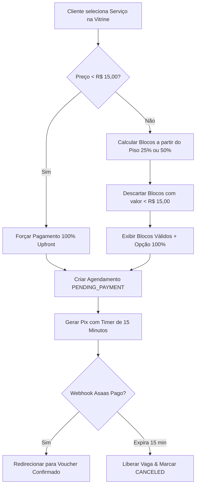
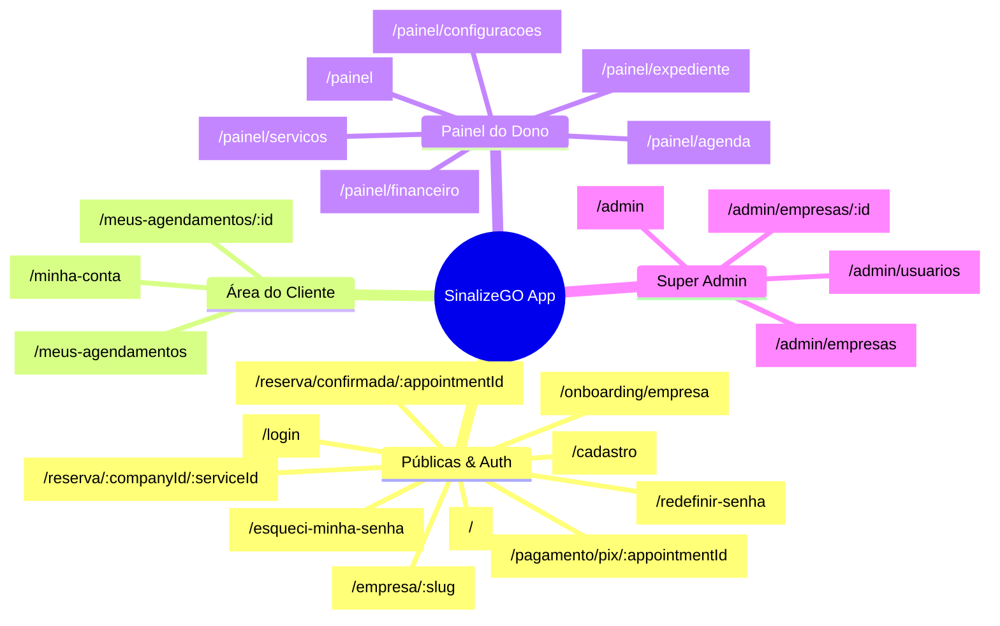

# 📑 Documento de Análise Arquitetural & Auditoria Técnica — Frontend SinalizeGO

**Versão**: 1.0.0  
**Data**: 23 de Agosto de 2026  
**Status**: Aprovado  
**Autor**: Equipe de Arquitetura SinalizeGO (Pair Programming com Antigravity Agent)

---

## 1. 🎯 Visão Geral do Sistema & Objetivos

O **SinalizeGO** é uma plataforma SaaS completa voltada para o mercado de barbearias, salões e estúdios de estética, permitindo agendamento online inteligente, vitrine pública de alta conversão, gestão operacional de expediente e pagamentos com split automatizado via Pix (Asaas Gateway).

Este documento formaliza a auditoria técnica de integração entre a API NestJS existente e a nova aplicação frontend construída com **React 19, Vite, TypeScript, Tailwind CSS v4 e PWA**.

---

## 2. 🔍 Auditoria Técnica de Pontos Críticos do Backend (Princípio KISS)

Antes da modelagem do frontend, o backend e o schema de banco de dados (`schema.prisma`) foram submetidos a uma auditoria rigorosa de estabilidade, concorrência e integridade:

### 2.1. Concorrência e Vagas Concorrentes (`chairsCount` vs `ServiceGroup.capacity`)
- **Regra de Negócio**: O motor de disponibilidade (`AvailabilityService.getAvailableSlots`) e a criação atômica de agendamento (`AppointmentsService.createAppointment`) utilizam **estritamente e exclusivamente** o campo `ServiceGroup.capacity` (`const maxCapacity = service.serviceGroup?.capacity ?? 1`).
- **Papel do `Company.chairsCount`**: Atua exclusivamente como metadado descritivo do estabelecimento para apresentação visual na vitrine pública / dashboard. Não interfere nos cálculos de horários livres.
- **Vantagem Arquitetural**: Permite que uma mesma barbearia configure capacidades concorrentes diferentes para cada categoria de serviço (ex: *Cabelo* com 3 cadeiras simultâneas, *Barboterapia* com 2 cadeiras e *Estética Facial* com 1 sala).

### 2.2. Relacionamento Financeiro (`User` ➔ `FinancialProfile` ➔ `Company`)
- **Modelagem Asaas**: No gateway Asaas, uma subconta bancária (`walletId`) é vinculada a uma pessoa física ou jurídica (titular do CPF/CNPJ).
- **Consistência Relacional**: A entidade `User` (Proprietário) detém o `FinancialProfile`, que por sua vez é associado à(s) `Company` de sua propriedade (`Company.financialProfileId`).
- **Benefício**: Permite que o dono do estabelecimento expanda para múltiplas filiais utilizando a mesma subconta bancária sem duplicar o processo de KYC/Onboarding no gateway.

### 2.3. Chaves Estrangeiras & Índices em `Transaction`
- **Vínculo por `barberWalletId`**: A tabela `transactions` referencia diretamente `FinancialProfile.walletId` (coluna marcada como `@unique` no PostgreSQL).
- **Cobertura de Índices**: Os índices existentes (`asaasPaymentId`, `appointmentId`, `status`) cobrem 100% dos caminhos de busca reais (processamento de webhooks, geração de Pix, conciliação e relatórios).

### 2.4. Armazenamento de Datas & Timezone
- **Armazenamento UTC**: O PostgreSQL + Prisma gravam todos os campos `DateTime` em padrão universal UTC (`TIMESTAMP(3)`).
- **Apresentação no Fuso Local**: O campo `Company.timezone` (padrão `'America/Sao_Paulo'`) é utilizado nas camadas de apresentação, e-mails transacionais e notificações através da API nativa `Intl.DateTimeFormat`.

---

## 3. 🛡️ Espelhamento das Regras de Negócio & Segurança no Frontend

O frontend foi desenhado com base no princípio **Zero Trust**, garantindo sincronia perfeita com as validações da API:

### 3.1. Micro-Transaction Safety Gate (Trava de R$ 15,00) & Blocos de Sinal
- **Serviços < R$ 15,00**: O frontend desabilita seleção fracionada e força **100% de pagamento antecipado**.
- **Serviços >= R$ 15,00**: A interface gera opções dinâmicas progressivas `[Piso Configurado (25% ou 50%), ..., 75%, 100%]`, descartando qualquer fração cujo valor monetário seja inferior a R$ 15,00.

### 3.2. Ciclo de Vida do Pix & Anti-DoS (15 Minutos)
- A tela de pagamento apresenta um cronômetro regressivo com base no campo `expiresAt` retornado pela API.
- Polling ativo via TanStack Query (`refetchInterval: 3000`) escuta a confirmação da transação para redirecionar instantaneamente o cliente para o voucher (`/reserva/confirmada/:appointmentId`).

### 3.3. Política de Cancelamento e Estorno Transparente
- **Cancelamento > 24h antes do horário**: Modal com aviso destacado informando que o sinal Pix será estornado integralmente para a conta de origem pelo gateway.
- **Cancelamento <= 24h**: Modal alertando que a vaga será liberada no calendário, mas o sinal será retido pelo estabelecimento como compensação de vacância.

---

## 4. 🎨 Design System Institucional (Dark Mode)

A identidade visual do SinalizeGO transmite autoridade, modernidade e alta tecnologia:

| Elemento Visual | Código HEX | Utilização na Interface |
|---|:---:|---|
| **Background Externo** | `#0B1120` | Fundo principal da página e body |
| **Card Principal** | `#0F172A` | Containers principais, modais e layouts de conteúdo |
| **Card Interno / Input** | `#1E293B` | Inputs de formulário, cards de serviço e tabelas |
| **Primária / Ação** | `#14B8A6` | Botões de CTA, links em destaque, badges de status `CONFIRMED` |
| **Primária Hover** | `#0D9488` | Estados de hover e foco ativo |
| **Alerta / Erro** | `#EF4444` | Badges `CANCELED`, mensagens de erro e botões destrutivos |
| **Texto Principal** | `#F8FAFC` | Títulos, cabeçalhos e valores em destaque |
| **Texto Secundário** | `#94A3B8` | Labels, legendas e textos de apoio |
| **Bordas Sutis** | `#334155` | Divisores de seção e bordas de cards |

---

## 5. 🗺️ Mapeamento Completo das 22 Rotas da Aplicação

---

## 6. 🛠️ Stack Tecnológica & Dependências

- **Runtime & Compilador**: React 19, TypeScript 5.7, Vite 6
- **Estilização**: Tailwind CSS v4, Lucide React, clsx, tailwind-merge
- **Componentes UI**: Radix UI Primitives (Dropdown, Dialog, Tabs, Popover, Select, Accordion)
- **Data Fetching & Cache**: TanStack Query (React Query v5) + Axios com Interceptors
- **Roteamento**: React Router DOM v7
- **Formulários & Schemas**: React Hook Form + Zod
- **PWA & Recursos Nativos**: `vite-plugin-pwa`, `qrcode.react`, `date-fns`, `sonner` (Toasts)
