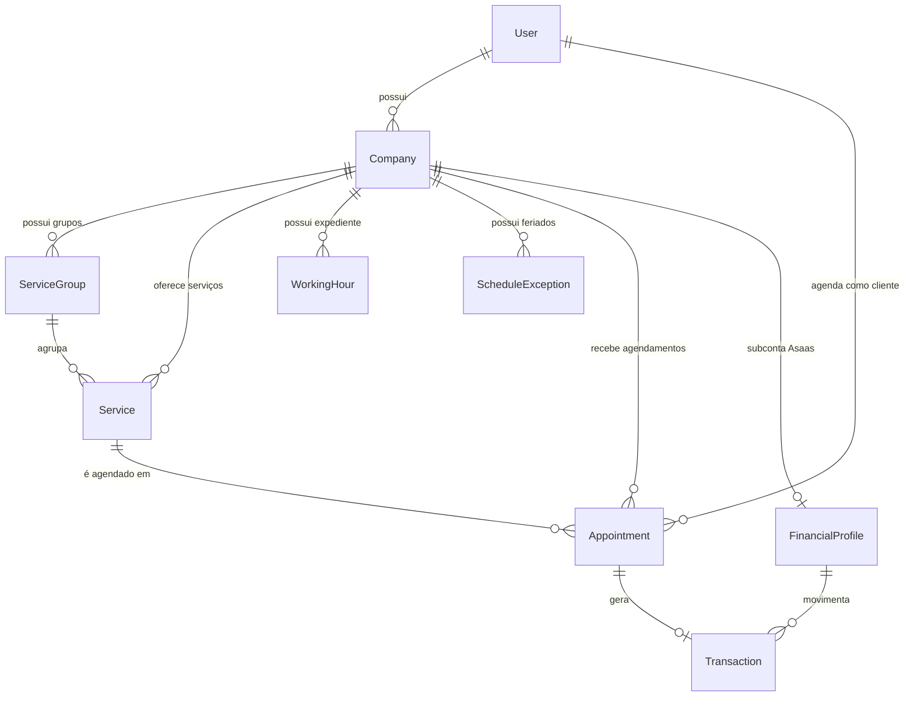

# 🤖 SinalizeGO API — Master OpenAPI Specification & AI Agent Reference Manual

> **Manual de Integração & Especificação Canônica da API NestJS SinalizeGO**  
> Este documento fornece a especificação técnica completa, exaustiva e estruturada no padrão **OpenAPI / Swagger 3.0** para consumo por **Agentes de Inteligência Artificial**, desenvolvedores de frontend, engenheiros de integração e rotinas automatizadas.

---

## 📑 Tabela de Conteúdos

1. [🌐 Arquitetura & Configurações Globais](#1--arquitetura--configurações-globais)
2. [🔐 Segurança, Autenticação & Sessão (JWT/RBAC)](#2--segurança-autenticação--sessão-jwtrbac)
3. [💰 Regras Financeiras, Fórmulas Matemáticas & Gateway](#3--regras-financeiras-fórmulas-matemáticas--gateway)
4. [🗄️ Dicionário de Dados & Entidades (Prisma ORM)](#4--dicionário-de-dados--entidades-prisma-orm)
5. [🛡️ Rate Limiting & Proteções de Infraestrutura](#5--rate-limiting--proteções-de-infraestrutura)
6. [📚 Catálogo Exaustivo de Endpoints (OpenAPI / Swagger)](#6--catálogo-exaustivo-de-endpoints-openapi--swagger)
   - [6.1. Autenticação (`/api/v1/auth`)](#61-autenticação-apiv1auth)
   - [6.2. Usuários (`/api/v1/users`)](#62-usuários-apiv1users)
   - [6.3. Empresas & Vitrine Pública (`/api/v1/company`)](#63-empresas--vitrine-pública-apiv1company)
   - [6.4. Grupos de Serviços & Capacidade (`/api/v1/service-group`)](#64-grupos-de-serviços--capacidade-apiv1service-group)
   - [6.5. Catálogo de Serviços & Splits (`/api/v1/company-service`)](#65-catálogo-de-serviços--splits-apiv1company-service)
   - [6.6. Expediente & Exceções/Feriados (`/api/v1/working-hours`)](#66-expediente--exceçõesferiados-apiv1working-hours)
   - [6.7. Agendamentos & Motor de Disponibilidade (`/api/v1/appointments`)](#67-agendamentos--motor-de-disponibilidade-apiv1appointments)
   - [6.8. Perfil Financeiro & Subcontas Asaas (`/api/v1/financial-profile`)](#68-perfil-financeiro--subcontas-asaas-apiv1financial-profile)
   - [6.9. Transações Pix & Conciliação (`/api/v1/transactions`)](#69-transações-pix--conciliação-apiv1transactions)
   - [6.10. Uploads Seguros de Mídia (`/api/v1/upload`)](#610-uploads-seguros-de-mídia-apiv1upload)
   - [6.11. Super Admin & Platform Intelligence (`/api/v1/admin`)](#611-super-admin--platform-intelligence-apiv1admin)
   - [6.12. Webhooks Assíncronos do Gateway Asaas (`/webhooks/asaas`)](#612-webhooks-assíncronos-do-gateway-asaas-webhooksasaas)
7. [🎨 Design Tokens & Diretrizes de UI (Dark Mode)](#7--design-tokens--diretrizes-de-ui-dark-mode)

---

## 1. 🌐 Arquitetura & Configurações Globais

- **Framework**: NestJS 11 (Modular, TypeScript Strict, Dependency Injection).
- **ORM**: Prisma 7 com PostgreSQL (Supabase Pooler).
- **Base URL Local**: `http://localhost:3000/api/v1`
- **Base URL Produção**: `https://api.sinalizego.com/api/v1` (ou variável `VITE_API_URL`)
- **Documentação Interativa Swagger**: `/api` e `/api/docs`
- **Rotas Globais Fora do Prefixo `/api/v1`**:
  - Webhook do Asaas: `/webhooks/asaas`
  - Health Check raiz: `/`
- **Políticas de CORS**:
  - Origens Padrão: `http://localhost:3000`, `http://localhost:5173`, `http://localhost:4200`, `https://sinalizego.com`, `https://app.sinalizego.com`, `https://admin.sinalizego.com`, `https://sinalizego.vercel.app`.
  - Preview Deployments da Vercel: Suporte automático via Regex `^https:\/\/.*\.vercel\.app$`.

---

## 2. 🔐 Segurança, Autenticação & Sessão (JWT/RBAC)

### 2.1. Cabeçalho de Autorização
Todas as rotas protegidas exigem o cabeçalho padrão HTTP:
```http
Authorization: Bearer <access_token>
```

### 2.2. Níveis de Permissão (Role-Based Access Control)
O ecossistema utiliza 5 roles hierárquicas:
1. **`CLIENT`**: Cliente final que agenda horários, efetua pagamentos Pix e consulta seu histórico pessoal de vouchers.
2. **`COMPANY_OWNER`**: Dono do estabelecimento. Gerencia serviços, expediente, relatórios financeiros, dados da barbearia e solicitações de saque.
3. **`EMPLOYEE`**: Barbeiro/Profissional associado (acesso operacional restrito à própria agenda).
4. **`ADMIN`**: Administrador operacional da plataforma.
5. **`SUPER_ADMIN`**: Executivo da plataforma com acesso irrestrito a auditorias, GMV global, faturamento SaaS, moderação e métricas.

### 2.3. Promoção Automática de Role
Quando um usuário com role `CLIENT` cadastra sua primeira empresa via `POST /api/v1/company/create`:
1. O backend promove o usuário no banco para `COMPANY_OWNER`.
2. A rota retorna imediatamente um **novo par de tokens (`access_token` e `refresh_token`)** com a claim `role: 'COMPANY_OWNER'`.
3. O frontend deve atualizar o estado de autenticação imediatamente, sem exigir novo login do usuário.

### 2.4. Ciclo de Renovação Stateless (Refresh Token)
- Ao receber **HTTP 401 Unauthorized** com token expirado:
  1. O interceptor HTTP deve pausar a fila de requisições.
  2. Disparar `POST /api/v1/auth/refresh` enviando o `refresh_token` no header `Authorization: Bearer <refresh_token>`.
  3. Atualizar os tokens em memória/storage e re-executar a requisição original.
  4. Se o refresh falhar, invalidar a sessão e redirecionar para `/login`.

### 2.5. Princípio Anti-IDOR & Zero Trust Multi-tenancy
- Parâmetros como `userId` ou `companyId` vindos de URLs ou bodies **nunca** são aceitos cegamente.
- O backend sempre valida a posse comparando `req.user.sub` contra o proprietário do recurso no banco de dados.

---

## 3. 💰 Regras Financeiras, Fórmulas Matemáticas & Gateway

> ⚠️ **Princípio Zero Trust Financeiro**: O frontend **NUNCA** envia valores em dinheiro, taxas ou porcentagens calculadas para a API. Todos os cálculos monetários são processados e congelados estritamente pelo backend.

```
+-----------------------------------------------------------------------------------+
|                            FLUXO FINANCEIRO DO SINAL                              |
+-----------------------------------------------------------------------------------+
| 1. Valor Total do Serviço (Ex: R$ 50,00)                                          |
| 2. Sinal Pago Online via Pix (Ex: 50% = R$ 25,00)                                 |
|    |                                                                              |
|    +--> Taxa Plataforma SinalizeGO (15% sobre R$ 25,00 = R$ 3,75) [Múltiplo 0,25] |
|    +--> Taxa Gateway Asaas Split (R$ 0,99)                                        |
|    +--> Líquido Barbeiro em Custódia (R$ 20,26) [Escrow Hold]                     |
|                                                                                   |
| 3. Valor Restante a Pagar no Salão (R$ 25,00 no Balcão)                           |
+-----------------------------------------------------------------------------------+
```

### 3.1. Piso de Sinal & Safety Gate de Microtransações (R$ 15,00)
1. **Configuração pelo Barbeiro**: Ao criar/editar um serviço, o dono define `downPaymentPercent` **estritamente como 25% ou 50%**.
2. **Safety Gate de R$ 15,00**:
   - Se `totalPrice < R$ 15,00`: O sistema **força 100% de pagamento antecipado** (ex: serviço de R$ 12,00 ➔ 100% Pix no checkout).
   - Se `totalPrice >= R$ 15,00`: O sistema gera blocos progressivos `[piso, ..., 75%, 100%]`. Qualquer opção que resulte em valor monetário `< R$ 15,00` é descartada.
   - *Exemplo (Serviço de R$ 40,00, Piso 25%)*:
     - 25% = R$ 10,00 (< R$ 15,00) ➔ **Descartado**
     - 50% = R$ 20,00 (>= R$ 15,00) ➔ **Liberado**
     - 75% = R$ 30,00 (>= R$ 15,00) ➔ **Liberado**
     - 100% = R$ 40,00 (>= R$ 15,00) ➔ **Liberado**
     - *Opções visíveis ao cliente*: `[50%, 75%, 100%]`.

### 3.2. Taxa da Plataforma (Faixas Cumulativas & Arredondamento)
A taxa retida pelo SinalizeGO é calculada sobre o **valor do sinal pago online** utilizando faixas progressivas:
- **Faixa 1 (até R$ 50,00)**: 15%
- **Faixa 2 (de R$ 50,01 a R$ 100,00)**: 10%
- **Faixa 3 (acima de R$ 100,00)**: 5%
- **Piso Mínimo Garantido (`MIN_PLATFORM_TAX`)**: **R$ 2,00**
- **Arredondamento para Cima (`Ceil`)**: O valor final é sempre arredondado para o **múltiplo superior de R$ 0,25** mais próximo:
  $$\text{TaxaFinal} = \max\left(2.00, \frac{\lceil \text{TaxaBruta} \times 4 \rceil}{4}\right)$$

### 3.3. Ciclo de Vida do Pix & Anti-DoS
- Cobranças Pix geradas possuem prazo de expiração de **15 minutos** (`expiresAt`).
- O cliente é limitado a no máximo **3 agendamentos simultâneos com status `PENDING_PAYMENT`**.
- Um Cron job a cada minuto cancela agendamentos pendentes expirados e remove a cobrança no Asaas.

### 3.4. Cancelamento & Blindagem Jurídica (CDC Art. 51 / CC Arts. 417 a 420)
- **Cancelamento Antecipado (`> 24h` antes do corte)**: O agendamento é cancelado e a API dispara **estorno integral (100%)** via Pix no Asaas.
- **Cancelamento Tardio (`<= 24h` antes do corte)**:
  - O sistema calcula o sinal mínimo de garantia da cadeira (`guaranteedDepositAmount`).
  - Se o cliente pagou apenas o sinal mínimo: 100% do valor pago é retido como indenização de vacância.
  - Se o cliente pagou valor superior (ex: adiantou 75% ou 100%): O backend **retém apenas o sinal mínimo** e processa o **estorno parcial automático do excedente** (`paidAmount - guaranteedDepositAmount`) via Pix no Asaas.

### 3.5. Liquidação em Custódia (Escrow Hold) & Política de Saques
1. **Trava de Custódia**: Os fundos recebidos via split entram na subconta Asaas como saldo retido (`escrowLockedBalance`) até o corte transicionar para `COMPLETED`.
2. **Auto-Conclusão Horária**: Cron job a cada hora conclui agendamentos confirmados cujo término ocorreu há mais de 24h sem contestação, liberando a custódia caso o barbeiro esqueça de clicar manualmente.
3. **Saque Automático Semanal Gratuito (`@Cron('0 6 * * 1')`)**: Toda segunda-feira às 06:00, o sistema transfere o saldo disponível (`availableBalance`) gratuitamente (`asaasFee = 0`) para empresas com `availableBalance >= R$ 100,00` (`MIN_FREE_WEEKLY_PAYOUT`).
4. **Regra de Acúmulo de Saldo**: Saldos inferiores a R$ 100,00 (ex: R$ 45,00) **não são perdidos nem cancelados**; eles continuam acumulando para as próximas semanas.
5. **Saque Avulso Sob Demanda (`POST /api/v1/company/withdraw`)**: O estabelecimento pode resgatar saldos `< R$ 100,00` a qualquer momento fora da segunda-feira, descontando a tarifa bancária Asaas de **R$ 5,00** (`ASAAS_TRANSFER_FEE`) com proteção atômica anti-race condition.

---

## 4. 🗄️ Dicionário de Dados & Entidades (Prisma ORM)

### 4.1. Enums do Sistema

```typescript
enum Role {
  CLIENT          // Cliente final
  PROVIDER        // Prestador avulso
  COMPANY_OWNER   // Dono de estabelecimento
  EMPLOYEE        // Funcionário/Barbeiro
  ADMIN           // Administrador da plataforma
  SUPER_ADMIN     // Administrador executivo
}

enum ApptStatus {
  PENDING_PAYMENT // Aguardando pagamento do Pix (15 min)
  CONFIRMED       // Pix pago, horário garantido (em custódia)
  COMPLETED       // Atendimento finalizado (saldo liberado)
  CANCELED        // Cancelado (com estorno integral ou parcial)
}

enum TransactionStatus {
  PENDING         // Aguardando processamento/pagamento
  CONFIRMED       // Confirmado e liquidado
  OVERDUE         // Vencido
  REFUNDED        // Estornado
  CANCELED        // Cancelado
}

enum TransactionType {
  DEPOSIT         // Entrada de sinal do agendamento
  WITHDRAWAL      // Saque/Transferência para o barbeiro
}

enum BillingType {
  PIX             // Cobrança instantânea via Pix
}
```

### 4.2. Modelos Relacionais



---

## 5. 🛡️ Rate Limiting & Proteções de Infraestrutura

A API responde com **HTTP 429 Too Many Requests** se os limites forem ultrapassados:

| Endpoint | Limite | Justificativa |
|---|:---:|---|
| **Global Padrão** | `120 req / 60s` | Proteção contra flooding e suporte a NAT |
| `GET /api/v1/appointments/available-slots` | `120 req / 60s` | Navegação fluida no calendário de datas |
| `POST /api/v1/auth/login` | `15 req / 60s` | Mitigação de força bruta / credential stuffing |
| `POST /api/v1/users/create` | `15 req / 60s` | Prevenção de criação massiva de contas fake |
| `POST /api/v1/auth/forgot-password` | `5 req / 60s` | Prevenção de spam de e-mails transacionais |
| `POST /api/v1/transactions/pix/:appointmentId` | `10 req / 60s` | Prevenção de geração abusiva de cobranças |
| `POST /webhooks/asaas` | `@SkipThrottle()` | Webhooks em tempo real do gateway de pagamento |

---

## 6. 📚 Catálogo Exaustivo de Endpoints (OpenAPI / Swagger)

---

### 6.1. Autenticação (`/api/v1/auth`)

#### `POST /api/v1/auth/login`
- **Sumário**: Autenticação de usuário por e-mail e senha.
- **Acesso**: Público (Rate limit: 15 req/60s).
- **Request Body (`LoginDto`)**:
  ```json
  {
    "email": "barbeiro@exemplo.com",
    "password": "SenhaSegura123!"
  }
  ```
- **Responses**:
  - `201 Created`:
    ```json
    {
      "access_token": "eyJhbGciOiJIUzI1NiIsInR5cCI6IkpXVCJ9...",
      "refresh_token": "eyJhbGciOiJIUzI1NiIsInR5cCI6IkpXVCJ9...",
      "user": {
        "id": "7b8702d0-3fa4-439a-a119-c5a2410f7e72",
        "name": "Antonio Gabriel",
        "email": "nascimentogabriel.2004@gmail.com",
        "role": "SUPER_ADMIN"
      }
    }
    ```
  - `401 Unauthorized`: `{ "statusCode": 401, "message": "Credenciais inválidas" }`

---

#### `POST /api/v1/auth/refresh`
- **Sumário**: Renova o Access Token utilizando o Refresh Token.
- **Acesso**: `Bearer <refresh_token>` no header `Authorization`.
- **Responses**:
  - `200 OK`:
    ```json
    {
      "access_token": "novo-access-token",
      "refresh_token": "novo-refresh-token"
    }
    ```
  - `401 Unauthorized`: Token inválido ou expirado.

---

#### `GET /api/v1/auth/me`
- **Sumário**: Retorna os dados do perfil autenticado.
- **Acesso**: `Bearer <access_token>`.
- **Responses**:
  - `200 OK`:
    ```json
    {
      "id": "7b8702d0-3fa4-439a-a119-c5a2410f7e72",
      "name": "Antonio Gabriel",
      "email": "nascimentogabriel.2004@gmail.com",
      "role": "SUPER_ADMIN",
      "phone": "75992197406",
      "cpfCnpj": null,
      "isActive": true
    }
    ```

---

#### `POST /api/v1/auth/logout`
- **Sumário**: Encerra a sessão e revoga o hash do refresh token.
- **Acesso**: `Bearer <access_token>`.
- **Responses**:
  - `200 OK`: `{ "message": "Logout realizado com sucesso" }`

---

#### `POST /api/v1/auth/forgot-password`
- **Sumário**: Solicita link de recuperação de senha por e-mail (Token dinâmico de 15 minutos).
- **Acesso**: Público (Rate limit: 5 req/60s).
- **Request Body (`ForgotPasswordDto`)**:
  ```json
  {
    "email": "cliente@exemplo.com"
  }
  ```
- **Responses**:
  - `200 OK`: `{ "message": "Se o e-mail informado estiver cadastrado, as instruções para redefinição de senha foram enviadas." }`

---

#### `POST /api/v1/auth/reset-password`
- **Sumário**: Redefine a senha utilizando o token de recuperação.
- **Acesso**: Público.
- **Request Body (`ResetPasswordDto`)**:
  ```json
  {
    "token": "jwt-stateless-token",
    "newPassword": "NovaSenhaSegura456!"
  }
  ```
- **Responses**:
  - `200 OK`: `{ "message": "Senha redefinida com sucesso." }`
  - `400 Bad Request`: Token expirado ou inválido.

---

### 6.2. Usuários (`/api/v1/users`)

#### `POST /api/v1/users/create`
- **Sumário**: Cadastro de novos usuários (Clientes, Proprietários ou Administradores).
- **Acesso**: Público (Rate limit: 15 req/60s).
- **Request Body (`CreateUserDto`)**:
  ```json
  {
    "name": "Carlos Silva",
    "email": "carlos@email.com",
    "password": "SenhaSegura123!",
    "phone": "75999999999",
    "role": "CLIENT"
  }
  ```
- **Responses**:
  - `201 Created`:
    ```json
    {
      "message": "Usuário criado com sucesso",
      "user": {
        "id": "uuid-user",
        "name": "Carlos Silva",
        "email": "carlos@email.com",
        "phone": "75999999999",
        "role": "CLIENT",
        "createdAt": "2026-08-23T20:00:00.000Z",
        "isActive": true
      }
    }
    ```
  - `409 Conflict`: E-mail ou telefone já em uso.

---

#### `PATCH /api/v1/users/update`
- **Sumário**: Atualiza nome e telefone do usuário autenticado.
- **Acesso**: `Bearer <access_token>`.
- **Request Body (`UpdateUserDto`)**:
  ```json
  {
    "name": "Carlos Silva Atualizado",
    "phone": "75988888888"
  }
  ```
- **Responses**:
  - `200 OK`: Objeto do usuário atualizado.

---

#### `PATCH /api/v1/users/update-cpf`
- **Sumário**: Cadastra/Atualiza CPF do cliente e cria cliente espelho no Asaas para emissão de Pix.
- **Acesso**: `Bearer <access_token>`.
- **Request Body (`UpdateCpfDto`)**:
  ```json
  {
    "cpfCnpj": "12345678909"
  }
  ```
- **Responses**:
  - `200 OK`: `{ "message": "CPF atualizado com sucesso", "user": { ... } }`

---

#### `PATCH /api/v1/users/change-password`
- **Sumário**: Altera a senha do usuário autenticado validando a senha anterior.
- **Acesso**: `Bearer <access_token>`.
- **Request Body (`ChangePasswordDto`)**:
  ```json
  {
    "oldPassword": "SenhaAntiga123!",
    "newPassword": "NovaSenhaForte456!"
  }
  ```
- **Responses**:
  - `200 OK`: `{ "message": "Senha alterada com sucesso." }`
  - `400 Bad Request`: Senha atual incorreta.

---

#### `DELETE /api/v1/users/me`
- **Sumário**: Desativação voluntária da própria conta (Soft Delete).
- **Acesso**: `Bearer <access_token>`.
- **Responses**:
  - `200 OK`: `{ "id": "...", "isActive": false, "disabledAt": "..." }`

---

#### `GET /api/v1/users/list`
- **Sumário**: Listagem global sanitizada de todos os usuários do sistema.
- **Acesso**: `SUPER_ADMIN`, `ADMIN`.
- **Responses**:
  - `200 OK`: Array de usuários sanitizados com `USER_PUBLIC_SELECT`.

---

#### `DELETE /api/v1/users/:userId` & `PATCH /api/v1/users/:userId/activate`
- **Sumário**: Suspensão ou reativação administrativa de conta de usuário.
- **Acesso**: `SUPER_ADMIN`, `ADMIN`.
- **Path Param**: `userId` (UUID).
- **Responses**:
  - `200 OK`: Objeto de usuário atualizado.

---

### 6.3. Empresas & Vitrine Pública (`/api/v1/company`)

#### `GET /api/v1/company/slug/:slug`
- **Sumário**: Consulta consolidada da Vitrine Pública do Estabelecimento (Storefront).
- **Acesso**: Público.
- **Path Param**: `slug` (string, ex: `barbearia-vintage`).
- **Responses**:
  - `200 OK`:
    ```json
    {
      "id": "uuid-company",
      "businessName": "Barbearia Vintage",
      "slug": "barbearia-vintage",
      "providerType": "Barbearia",
      "whatsapp": "75999999999",
      "district": "Centro",
      "street": "Av. Getúlio Vargas",
      "city": "Feira de Santana",
      "state": "BA",
      "zipCode": "44000000",
      "number": "100",
      "logoPhoto": "https://res.cloudinary.com/.../logo.png",
      "bannerPhoto": "https://res.cloudinary.com/.../banner.png",
      "timezone": "America/Sao_Paulo",
      "workingHours": [
        {
          "dayOfWeek": 1,
          "startTime": "09:00",
          "endTime": "19:00",
          "lunchStartTime": "12:00",
          "lunchEndTime": "13:00",
          "isClosed": false
        }
      ],
      "serviceGroups": [
        {
          "id": "uuid-group",
          "name": "Cabelo & Barba",
          "capacity": 2,
          "services": [
            {
              "id": "uuid-service",
              "name": "Corte Degradê",
              "description": "Corte com acabamento na navalha",
              "durationMinutes": 30,
              "totalPrice": 45.00,
              "downPaymentPercent": 25
            }
          ]
        }
      ]
    }
    ```
  - `404 Not Found`: Empresa não encontrada.

---

#### `POST /api/v1/company/create`
- **Sumário**: Cria o estabelecimento para o usuário logado com geração automática de slug e promoção para `COMPANY_OWNER`.
- **Acesso**: `CLIENT`, `COMPANY_OWNER`.
- **Request Body (`CreateCompanyDto`)**:
  ```json
  {
    "businessName": "Barber Shop Vintage",
    "providerType": "Barbearia",
    "phone": "75999999999",
    "state": "BA",
    "city": "Feira de Santana",
    "district": "Centro",
    "street": "Av. Getúlio Vargas",
    "zipCode": "44000000",
    "number": "123",
    "chairsCount": 3
  }
  ```
- **Responses**:
  - `201 Created`:
    ```json
    {
      "message": "Empresa criada com sucesso",
      "company": {
        "id": "uuid-company",
        "businessName": "Barber Shop Vintage",
        "slug": "barber-shop-vintage",
        "providerType": "Barbearia",
        "city": "Feira de Santana",
        "state": "BA"
      },
      "access_token": "token-atualizado-como-company-owner",
      "refresh_token": "refresh-token-atualizado"
    }
    ```

---

#### `GET /api/v1/company/dashboard/metrics`
- **Sumário**: Painel analítico e métricas financeiras/operacionais da empresa autenticada.
- **Acesso**: `COMPANY_OWNER`, `ADMIN`.
- **Query Params**: `?startDate=YYYY-MM-DD&endDate=YYYY-MM-DD`.
- **Responses**:
  - `200 OK`:
    ```json
    {
      "company": { "id": "uuid", "businessName": "Barber Shop Vintage", "slug": "barber-shop-vintage" },
      "period": { "startDate": "2026-08-01T00:00:00.000Z", "endDate": "2026-08-23T23:59:59.999Z" },
      "financial": {
        "totalRevenue": 2450.00,
        "totalDownPaymentCollected": 820.00,
        "totalPlatformFees": 112.50,
        "netIncome": 2337.50,
        "availableBalance": 720.00,
        "escrowLockedBalance": 100.00,
        "totalWithdrawn": 500.00
      },
      "volume": {
        "total": 56,
        "completed": 45,
        "confirmed": 5,
        "canceled": 4,
        "pendingPayment": 2,
        "completionRate": 88.5
      },
      "topServices": [
        { "serviceId": "uuid-srv", "serviceName": "Corte Degradê", "appointmentsCount": 28, "totalRevenue": 1400.00 }
      ],
      "upcomingToday": [
        {
          "id": "uuid-appt",
          "appointmentDate": "2026-08-23T14:30:00.000Z",
          "appointmentEndDate": "2026-08-23T15:00:00.000Z",
          "clientName": "Carlos Silva",
          "clientPhone": "75999999999",
          "serviceName": "Corte Degradê",
          "durationMinutes": 30,
          "downPaymentAmount": 15.00,
          "servicePrice": 45.00,
          "amountToPayInSalon": 30.00
        }
      ]
    }
    ```

---

#### `GET /api/v1/company/balance`
- **Sumário**: Consulta em tempo real saldo liberado para saque, saldo em custódia (Escrow Hold), próximo saque gratuito e elegibilidade.
- **Acesso**: `COMPANY_OWNER`, `ADMIN`.
- **Responses**:
  - `200 OK`:
    ```json
    {
      "companyId": "uuid-company",
      "businessName": "Barber Shop Vintage",
      "walletId": "wal_1234567890",
      "availableBalance": 720.00,
      "escrowLockedBalance": 100.00,
      "completedNetRevenue": 1220.00,
      "totalWithdrawn": 500.00,
      "nextFreeWithdrawalDate": "2026-08-31T06:00:00.000Z",
      "instantTransferFee": 5.00,
      "minFreeWeeklyPayoutThreshold": 100.00,
      "eligibleForFreeWeeklyPayout": true
    }
    ```

---

#### `POST /api/v1/company/withdraw`
- **Sumário**: Solicitação de saque avulso sob demanda fora do ciclo semanal gratuito com dedução da tarifa Asaas de R$ 5,00 e trava atômica anti-concorrência.
- **Acesso**: `COMPANY_OWNER`, `ADMIN`.
- **Request Body (`WithdrawDto`)** *(opcional, se omitido saca 100% do saldo disponível)*:
  ```json
  {
    "amount": 100.00
  }
  ```
- **Responses**:
  - `201 Created`:
    ```json
    {
      "message": "Saque avulso solicitado com sucesso.",
      "withdrawal": {
        "id": "uuid-transaction",
        "requestedAmount": 100.00,
        "transferFee": 5.00,
        "netAmountTransferred": 95.00,
        "status": "CONFIRMED",
        "transferredAt": "2026-08-23T20:30:00.000Z",
        "remainingAvailableBalance": 620.00,
        "escrowLockedBalance": 100.00
      }
    }
    ```
  - `400 Bad Request`: Saldo insuficiente ou valor solicitado `<= R$ 5,00`.
  - `409 Conflict`: Já existe um saque em processamento para este estabelecimento.

---

#### `GET /api/v1/company/withdrawals`
- **Sumário**: Extrato completo e histórico auditado de saques e transferências da empresa.
- **Acesso**: `COMPANY_OWNER`, `ADMIN`.
- **Responses**:
  - `200 OK`:
    ```json
    [
      {
        "id": "uuid-transaction",
        "requestedAmount": 100.00,
        "transferFee": 5.00,
        "netAmountTransferred": 95.00,
        "status": "CONFIRMED",
        "isFreeWeekly": false,
        "asaasTransferId": "tra_123456",
        "transferredAt": "2026-08-23T20:30:00.000Z"
      }
    ]
    ```

---

#### `PATCH /api/v1/company/update/:companyId`
- **Sumário**: Atualização de dados cadastrais, endereço e fotos da empresa.
- **Acesso**: `COMPANY_OWNER`.
- **Request Body (`UpdateCompanyDto`)**: Campos parciais opcionais.
- **Responses**:
  - `200 OK`: Empresa atualizada.

---

### 6.4. Grupos de Serviços & Capacidade (`/api/v1/service-group`)

#### `POST /api/v1/service-group`
- **Sumário**: Cadastra novo grupo com limite de capacidade de atendimentos simultâneos (cadeiras/profissionais).
- **Acesso**: `COMPANY_OWNER`.
- **Request Body (`CreateServiceGroupDto`)**:
  ```json
  {
    "name": "Barba Terapia & Cuidados",
    "capacity": 2,
    "companyId": "uuid-company"
  }
  ```
- **Responses**:
  - `201 Created`: `{ "id": "uuid-group", "name": "Barba Terapia & Cuidados", "capacity": 2 }`

---

#### `GET /api/v1/service-group` & `GET /api/v1/service-group/company/:companyId`
- **Sumário**: Lista os grupos de serviços da empresa.
- **Acesso**: `COMPANY_OWNER`, `INTERNAL_USERS`.
- **Responses**:
  - `200 OK`: Array de grupos ativos com suas respectivas capacidades.

---

#### `PUT /api/v1/service-group/:id` & `DELETE /api/v1/service-group/:id`
- **Sumário**: Edição e desativação segura (Soft Delete com `Restrict` em agendamentos ativos).
- **Acesso**: `COMPANY_OWNER`.

---

### 6.5. Catálogo de Serviços & Splits (`/api/v1/company-service`)

#### `POST /api/v1/company-service`
- **Sumário**: Cadastra novo serviço associado a um grupo e com percentual de sinal configurado (25% ou 50%).
- **Acesso**: `COMPANY_OWNER`.
- **Request Body (`CreateCompanyServiceDto`)**:
  ```json
  {
    "name": "Corte Degradê Navalhado",
    "description": "Corte na máquina e navalha com toalha quente",
    "durationMinutes": 30,
    "totalPrice": 50.00,
    "downPaymentPercent": 25,
    "serviceGroupId": "uuid-service-group",
    "companyId": "uuid-company"
  }
  ```
  *(Nota: `downPaymentPercent` aceita exclusivamente `25` ou `50`)*.
- **Responses**:
  - `201 Created`: Objeto do serviço criado.
  - `400 Bad Request`: Subconta Asaas ausente ou percentual fora de `[25, 50]`.

---

#### `GET /api/v1/company-service/company/:companyId`
- **Sumário**: Consulta pública do catálogo ativo de serviços da empresa.
- **Acesso**: Público.
- **Responses**:
  - `200 OK`: Array de serviços ativos agrupados por categoria.

---

#### `PUT /api/v1/company-service/:id` & `DELETE /api/v1/company-service/:id`
- **Sumário**: Edição ou desativação de serviço do catálogo.
- **Acesso**: `COMPANY_OWNER`.

---

### 6.6. Expediente & Exceções/Feriados (`/api/v1/working-hours`)

#### `PUT /api/v1/working-hours`
- **Sumário**: Atualiza a grade semanal de funcionamento da barbearia (dias, horários de abertura, fechamento e almoço).
- **Acesso**: `COMPANY_OWNER`.
- **Request Body (`UpdateWorkingHoursDto`)**:
  ```json
  {
    "workingHours": [
      { "dayOfWeek": 0, "startTime": "00:00", "endTime": "00:00", "isClosed": true },
      { "dayOfWeek": 1, "startTime": "09:00", "endTime": "19:00", "lunchStartTime": "12:00", "lunchEndTime": "13:00", "isClosed": false },
      { "dayOfWeek": 2, "startTime": "09:00", "endTime": "19:00", "lunchStartTime": "12:00", "lunchEndTime": "13:00", "isClosed": false },
      { "dayOfWeek": 3, "startTime": "09:00", "endTime": "19:00", "lunchStartTime": "12:00", "lunchEndTime": "13:00", "isClosed": false },
      { "dayOfWeek": 4, "startTime": "09:00", "endTime": "19:00", "lunchStartTime": "12:00", "lunchEndTime": "13:00", "isClosed": false },
      { "dayOfWeek": 5, "startTime": "09:00", "endTime": "20:00", "lunchStartTime": "12:00", "lunchEndTime": "13:00", "isClosed": false },
      { "dayOfWeek": 6, "startTime": "08:00", "endTime": "18:00", "lunchStartTime": null, "lunchEndTime": null, "isClosed": false }
    ]
  }
  ```
- **Responses**:
  - `200 OK`: Grade semanal atualizada.

---

#### `POST /api/v1/working-hours/exceptions`
- **Sumário**: Cadastra feriado, folga coletiva ou dia com horário de funcionamento especial.
- **Acesso**: `COMPANY_OWNER`.
- **Request Body (`CreateScheduleExceptionDto`)**:
  ```json
  {
    "date": "2026-12-25",
    "isClosed": true,
    "description": "Feriado de Natal"
  }
  ```
  *Ou para horário reduzido:*
  ```json
  {
    "date": "2026-12-24",
    "isClosed": false,
    "startTime": "08:00",
    "endTime": "14:00",
    "description": "Véspera de Natal"
  }
  ```
- **Responses**:
  - `201 Created`: Exceção cadastrada.

---

#### `GET /api/v1/working-hours/exceptions` & `DELETE /api/v1/working-hours/exceptions/:id`
- **Sumário**: Listagem de exceções futuras e remoção/restauração do expediente normal.
- **Acesso**: `COMPANY_OWNER`.

---

### 6.7. Agendamentos & Motor de Disponibilidade (`/api/v1/appointments`)

#### `GET /api/v1/appointments/available-slots`
- **Sumário**: Motor canônico de fatiamento de horários disponíveis.
- **Acesso**: Público (Rate limit: 120 req/60s).
- **Query Params**:
  - `companyId` (UUID, obrigatório)
  - `serviceId` (UUID, obrigatório)
  - `date` (`YYYY-MM-DD`, obrigatório)
- **Responses**:
  - `200 OK`:
    ```json
    {
      "date": "2026-08-25",
      "totalAvailable": 6,
      "slots": ["09:00", "09:30", "10:00", "10:30", "14:00", "14:30"]
    }
    ```

---

#### `POST /api/v1/appointments`
- **Sumário**: Cria a reserva de horário com retenção de 15 minutos para pagamento Pix.
- **Acesso**: `CLIENT`, `COMPANY_OWNER`.
- **Request Body (`CreateAppointmentDto`)**:
  ```json
  {
    "companyId": "uuid-company",
    "serviceId": "uuid-service",
    "appointmentDate": "2026-08-25T14:00:00.000Z",
    "downPaymentPercent": 50
  }
  ```
- **Responses**:
  - `201 Created`:
    ```json
    {
      "id": "uuid-appointment",
      "companyId": "uuid-company",
      "serviceId": "uuid-service",
      "clientId": "uuid-user",
      "appointmentDate": "2026-08-25T14:00:00.000Z",
      "appointmentEndDate": "2026-08-25T14:30:00.000Z",
      "status": "PENDING_PAYMENT",
      "servicePrice": 50.00,
      "downPaymentAmount": 25.00,
      "platformFeeAmount": 3.75,
      "expiresAt": "2026-08-23T20:45:00.000Z"
    }
    ```
  - `409 Conflict`: Horário indisponível ou capacidade máxima do grupo atingida.

---

#### `GET /api/v1/appointments/client/me` & `GET /api/v1/appointments/company/:companyId`
- **Sumário**: Listagem de agendamentos por cliente ou painel da empresa.
- **Acesso**: Autenticado.

---

#### `PATCH /api/v1/appointments/:id/complete`
- **Sumário**: Conclusão formal do atendimento e liberação de custódia (Escrow Hold).
- **Acesso**: `COMPANY_OWNER`, `ADMIN`.
- **Responses**:
  - `200 OK`: `{ "id": "...", "status": "COMPLETED" }`

---

#### `DELETE /api/v1/appointments/:id/client`
- **Sumário**: Cancelamento solicitado pelo cliente com estorno integral (`> 24h`) ou estorno parcial do excedente (`<= 24h`).
- **Acesso**: `CLIENT`, `COMPANY_OWNER`.
- **Responses**:
  - `200 OK`: `{ "id": "...", "status": "CANCELED", "isActive": false, "disabledAt": "..." }`

---

### 6.8. Perfil Financeiro & Subcontas Asaas (`/api/v1/financial-profile`)

#### `POST /api/v1/financial-profile`
- **Sumário**: Criação de subconta bancária no Asaas com criptografia de credenciais em repouso (AES-256-GCM).
- **Acesso**: `COMPANY_OWNER`.
- **Request Body (`CreateFinancialProfileDto`)**:
  ```json
  {
    "name": "Carlos Roberto da Silva",
    "email": "carlos@barbearia.com",
    "cpfCnpj": "12345678901",
    "birthDate": "1990-05-15",
    "mobilePhone": "75999999999",
    "incomeValue": 6000.00,
    "address": "Avenida Getúlio Vargas",
    "addressNumber": "1500",
    "province": "Centro",
    "postalCode": "44001000"
  }
  ```
- **Responses**:
  - `201 Created`: Objeto do perfil financeiro com `walletId` provisionado.

---

### 6.9. Transações Pix & Conciliação (`/api/v1/transactions`)

#### `POST /api/v1/transactions/pix/:appointmentId`
- **Sumário**: Gera a cobrança Pix com split automático para a subconta do barbeiro.
- **Acesso**: Autenticado (Rate limit: 10 req/60s).
- **Responses**:
  - `201 Created`:
    ```json
    {
      "paymentId": "pay_1234567890",
      "totalValue": 25.00,
      "qrCodePayload": "00020126580014BR.GOV.BCB.PIX0136...",
      "qrCodeImage": "data:image/png;base64,iVBORw0KGgo...",
      "expirationDate": "2026-08-23T20:45:00.000Z",
      "barberNetValue": 20.26,
      "platformFee": 3.75,
      "asaasFee": 0.99
    }
    ```

---

### 6.10. Uploads Seguros de Mídia (`/api/v1/upload`)

#### `POST /api/v1/upload/image`
- **Sumário**: Upload seguro de fotos de perfil, logo e banners para Cloudinary com validação binária de Magic Bytes.
- **Acesso**: `COMPANY_OWNER`, `ADMIN`.
- **Form Data**:
  - `file`: Binário (JPEG, PNG, WEBP, máx 5MB).
  - `companyId`: UUID da empresa.
- **Responses**:
  - `201 Created`: `{ "url": "https://res.cloudinary.com/...", "public_id": "..." }`

---

### 6.11. Super Admin & Platform Intelligence (`/api/v1/admin`)

#### `GET /api/v1/admin/dashboard/metrics`
- **Sumário**: Métricas executivas globais da plataforma (GMV, Lucro Líquido SaaS, Custos de Gateway, Ranking).
- **Acesso**: `SUPER_ADMIN`, `ADMIN`.
- **Responses**:
  - `200 OK`:
    ```json
    {
      "period": { "startDate": "2026-08-01T00:00:00.000Z", "endDate": "2026-08-31T23:59:59.999Z" },
      "financial": {
        "platformGrossRevenue": 4500.00,
        "totalAsaasPixCosts": 89.10,
        "platformNetProfit": 4410.90,
        "gmv": 45000.00
      },
      "growth": {
        "users": { "total": 250, "clients": 210, "owners": 40 },
        "companies": { "total": 40, "active": 38, "inactive": 2 },
        "appointments": { "total": 1200, "completed": 980, "confirmed": 120, "canceled": 70, "pendingPayment": 30 }
      },
      "topTenants": [
        {
          "companyId": "uuid",
          "businessName": "Barber's Shop VIP",
          "slug": "barbers-shop-vip",
          "appointmentsCount": 250,
          "totalRevenue": 12500.00,
          "platformFeeGenerated": 1250.00
        }
      ]
    }
    ```

---

#### `GET /api/v1/admin/companies` & `PATCH /api/v1/admin/companies/:id/toggle-status`
- **Sumário**: Listagem paginada e moderação/suspensão de estabelecimentos da plataforma.
- **Acesso**: `SUPER_ADMIN`, `ADMIN`.

---

### 6.12. Webhooks Assíncronos do Gateway Asaas (`/webhooks/asaas`)

#### `POST /webhooks/asaas`
- **Sumário**: Receptor de notificações assíncronas do Asaas com idempotência e verificação de assinatura.
- **Acesso**: Público (Protegido por token secreto no header `asaas-access-token`).
- **Eventos Processados**:
  - `PAYMENT_CONFIRMED` / `PAYMENT_RECEIVED`: Transiciona o agendamento para `CONFIRMED` e aloca fundos em custódia.
  - `PAYMENT_OVERDUE` / `PAYMENT_DELETED`: Transiciona o agendamento para `CANCELED` e libera o horário no calendário.
  - `PAYMENT_REFUNDED`: Registra o estorno no ledger da transação.
  - `PAYMENT_CHARGEBACK_REQUESTED`: Alerta de disputa de cobrança.

---

## 7. 🎨 Design Tokens & Diretrizes de UI (Dark Mode)

- **Fundo Principal (Background)**: `#0B1120`
- **Superfícies / Cards Principais**: `#0F172A`
- **Cards Internos / Modais / Inputs**: `#1E293B`
- **Cor Primária / Destaque / CTA (Teal)**: `#14B8A6` (Hover: `#0D9488`)
- **Status Sucesso**: `#10B981`
- **Status Alerta / Atenção**: `#F59E0B`
- **Status Erro / Cancelamento**: `#EF4444`
- **Textos Primários**: `#F8FAFC`
- **Textos Secundários / Muted**: `#94A3B8`
- **Bordas & Separadores**: `#334155`
- **Tipografia**: `Inter, -apple-system, BlinkMacSystemFont, 'Segoe UI', Roboto, sans-serif`
